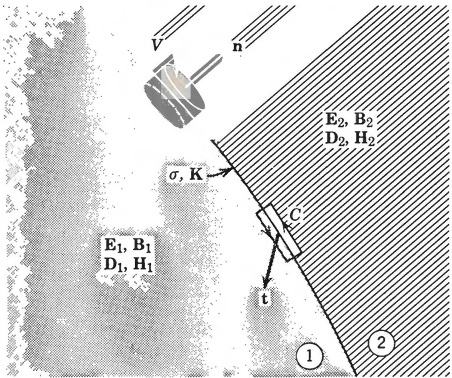

<!-- ## Gaussian Units
 -->
- [Maxwell's Equation](#maxwells-equation)
  - [In the case of a vacuum](#in-the-case-of-a-vacuum)
  - [Contunuity Equation](#contunuity-equation)
  - [The Maxwell's Equations in Macroscopic Midia](#the-maxwells-equations-in-macroscopic-midia)
  - [Boundary Conditions at Interfaces between Different Media](#boundary-conditions-at-interfaces-between-different-media)
  - [Electrostatics](#electrostatics)
  - [Delta Function](#delta-function)
  - [Gauss's Law](#gausss-law)
  - [Scalar Potential](#scalar-potential)
  - [Poisson's and Laplas Equation](#poissons-and-laplas-equation)
  - [Green's Theorem](#greens-theorem)
    - [Divergence Theorem](#divergence-theorem)
  - [Uniqueness of the Solution with Dirichlet or Neumann Boundary Conditions](#uniqueness-of-the-solution-with-dirichlet-or-neumann-boundary-conditions)

# Maxwell's Equation

$$\begin{equation}
  \vec{\nabla} \cdot \vec{D}  = \rho
\end{equation}$$ 
$$\begin{equation}
  \vec{\nabla} \times \vec{H}  - \frac{\partial \vec{D}}{\partial t} = \vec{J}
\end{equation}$$
$$\begin{equation}
  \vec{\nabla} \times \vec{E}  + \frac{\partial \vec{B}}{\partial t} = 0
\end{equation}$$
$$\begin{equation}
  \vec{\nabla} \cdot \vec{B}  = 0 
\end{equation}$$

## In the case of a vacuum
$$\begin{equation}
  \vec{D} = \epsilon_0 \vec{E}
\end{equation}$$
$$\begin{equation}
  \vec{B} = \mu_0 \vec{H}
\end{equation}$$
$$\begin{equation}
  C^{-2} = \epsilon_0\mu_0
\end{equation}$$
$$\begin{equation}
  \vec{\nabla}\cdot\vec{E} = \frac{\rho}{\epsilon_0}
\end{equation}$$
$$\begin{equation}
  \vec{\nabla}\times\vec{B} - \frac{1}{C^2}\frac{\delta \vec{E}}{\delta t} = \mu_0\vec{J}
\end{equation}$$

## Contunuity Equation
Taking the divergence of the  equation $(2)$ and replacing $\vec{\nabla}\cdot\frac{\delta\vec{D}}{\delta t}$ with $\frac{\delta \rho}{\delta t}$ by using equation $(1)$ gives
$$\begin{equation}\frac{\delta \rho}{\delta t} + \vec{\nabla}\cdot\vec{J} = 0\end{equation}$$

## The Maxwell's Equations in Macroscopic Midia

The other aspect is that for macroscopic observations the detailed behavior of the fields, with their drastic variations in space over atomic distances, is not relevant. What is relevant is the average of a field or a source over a volume large compared to the volume occupied by a single atom or molecule. We call such averaged quantities the macroscopic fields and macroscopic sources.

$$\begin{equation} D_{\alpha} = \epsilon_0 E_{\alpha} + \left[ P_{\alpha} - \sum_{\beta} \frac{\delta Q_{\alpha \beta}}{\delta X_\beta} \right] \end{equation}$$
$$\begin{equation} H_{\alpha} = \frac{1}{\mu_0} B_{\alpha} + \left[ -M_\alpha + .... \right] \end{equation}$$
Magnetic Dipoles

$$\begin{equation} D_\alpha(\vec{x}, t) = \int d^3\vec{x}^, \int dt^, \epsilon_{\alpha \beta}(\vec{x}^, , t)E_\beta(\vec{x} - \vec{x}^,, t - t^,) \end{equation}$$
$t - t^,$ is resopnse time, system takes time to respond to the change in the field.

$\vec{x} - \vec{x}^,$ Non local response

Transforming the equation $(13)$ using the Fourier transform gives
$$f(\^{k}, w) = \int d^3x\int dt \int F(x, t) e^{-i(\^{k}\vec{x} - wt)}$$

Now we get 
$$\begin{equation} D_\alpha (\^{k}, w) = \epsilon_{\alpha \beta}(\^{k}, w)E_\beta(\^{k}, w) \end{equation}$$

## Boundary Conditions at Interfaces between Different Media 

Let V be a finite volume in space, S the closed surface (or surfaces) bounding it, da an element of area on the surface, and n a unit normal to the surface at da pointing outward from the enclosed volume. Then the divergence theorem applied to the equations (1 and 4) yields the integral statements
$$\begin{equation} \int_V \vec{\nabla} \cdot \vec{D} dV = \int_S \vec{D} \cdot \vec{n} da = \int_V \rho dV \end{equation}$$

$$\begin{equation} \int_V \vec{\nabla} \cdot \vec{B} dV = \int _S\vec{B}.\^{x}da =0 \end{equation}$$

The first of these equations is the Gauss law for electric charge, and the second is the Gauss law for magnetic flux. The second equation is a consequence of the fact that the magnetic field is a vector potential, and therefore the divergence of the magnetic field is zero. The first equation is a consequence of the fact that the electric field is a scalar potential, and therefore the divergence of the electric field is equal to the charge density.

The first relation is just Gauss's law that the total flux of D out through the surface. is proportional to the charge contained inside. The second is the magnetic analog, with no net flux of B through a closed surface because of the nonexistence of magnetic charges. 

 let C be a closed contour in space, S' an open surface spanning the contour, di a line element on the contour, da an element of area on S', and n' a unit normal at da pointing in the direction given by the right-hand rule from the sense of integration around the contour. Then applying Stokes's theorem to the equations (2, 3) gives the integral statements 
 $$\begin{equation} \int_S \vec{\nabla} \times \vec{E} da = \int_C \vec{E}dl=-\int \frac{d \vec{B}}{d t} da \end{equation}$$
 $$\begin{equation} \int_S \vec{\nabla} \times \vec{H} da = \int_C \vec{H}dl=\int_S \left(J + \frac{d \vec{D}}{d t}\right) da \end{equation}$$

 

 Using equations 15 and 16, we can write the boundary conditions at the interface between two media as

$$\begin{equation}
  \left[\vec{D}_2.\^{n} - \vec{D}_1.\^{n} \right]\Delta a = \delta \Delta a
\end{equation}$$

$$\left[\vec{D}_2 - \vec{D}_1 \right]\^{n} = \delta$$

Similarly, the boundary conditions for the magnetic field are
$$\^{n} (H_2 - H_1) = \vec{K}$$

## Electrostatics
 $$\begin{equation}
  \vec{F} = \frac{1}{4\pi\epsilon_0} \frac{q_1q_2}{r^2} \hat{r}
 \end{equation}$$
 $$\begin{equation}
  \vec{E} = \frac{1}{4\pi\epsilon_0} \sum \frac{q_i(\vec{x} - \vec{x}_i)}{(\vec{x} - \vec{x}_i)^3}  = \frac{1}{4\pi\epsilon_0} \int d^3\vec{x}' \frac{\rho(\vec{x}')(\vec{x} - \vec{x}')}{(\vec{x} - \vec{x}')^3}
  \end{equation}$$

## Delta Function
$$\begin{equation}
  \delta(\vec{x} - \vec{x}_0) = 0 \quad \text{for} \quad \vec{x} \neq \vec{x}_0
\end{equation}$$
$$\begin{equation}
    \int d^3\vec{x} \delta(\vec{x} - \vec{x}_0) = 1  \quad \text{Unit } L^{-3} 
\end{equation}$$

$$\begin{equation}
  \int d^3\vec{x} \delta(\vec{x} - \vec{x}_0) \vec{f}(\vec{x}) = \vec{f}(\vec{x}_0) 
\end{equation}$$

$$\begin{equation}
  \int d^3\vec{x} \delta '(\vec{x} - \vec{x}_0) \vec{f}(\vec{x}) = -\vec{f}'(\vec{x}_0)
\end{equation}$$

$$\begin{equation}
  \delta(f(x)) = \sum \frac{\delta(x - x_i)}{|f'(x_i)|}
\end{equation}$$

## Gauss's Law
$$\begin{equation}
  \int \vec{E}.\^{n} da = \int \frac{q}{4\pi\epsilon_0} \frac{\cos \theta}{r^2} da
\end{equation}$$

$$\cos \theta da = r^2 d \Omega \quad \text{Solid angle}$$
$$\vec{E}.\^{n} da = \frac{q}{4\pi \epsilon_0} d \Omega$$

$$\begin{equation}
  
\oint E \^n da = \left \{ \begin{align*}
  \frac{q}{\epsilon_0} & \quad\text{for closed surface} \\
  0 & \quad\text{ for open surface}
\end{align*}\right.
\end{equation}$$

## Scalar Potential

$$\begin{equation*}
  \vec{E}  = \frac{1}{4\pi\epsilon_0} \int d^3\vec{x}' \frac{\rho(\vec{x}')(\vec{x} - \vec{x}')}{(\vec{x} - \vec{x}')^3}
  
\end{equation*}$$
$$\begin{equation*}
\frac{(\vec{x} - \vec{x}')}{(\vec{x} - \vec{x}')^3} = -\nabla \left(\frac{1}{|\vec{x} - \vec{x}'|}\right)
\end{equation*}$$

$$\begin{equation}
  \phi(\vec{x}) = \frac{1}{4\pi\epsilon_0} \int d^3\vec{x}' \frac{\rho(\vec{x}')}{|\vec{x} - \vec{x}'|}
\end{equation}$$

$$\begin{equation}
  \vec{E} = -\vec{\nabla} \phi
\end{equation}$$

## Poisson's and Laplas Equation

$$\begin{equation}
  \nabla^2 \phi = -\rho/\epsilon_0 \quad \text{Poisson equation}
\end{equation}$$

In regions of space where there is no charge density, the scalar potential satisfies the *Laplace equation*:

$$\begin{equation}
  \nabla^2 \phi = 0
\end{equation}$$

$$\begin{equation}
  \nabla^2 \left(\frac{1}{|\vec{x} - \vec{x}'|}\right) = -4\pi \delta^3(\vec{x} - \vec{x}')
\end{equation}$$

## Green's Theorem

### Divergence Theorem

$$\begin{equation}
  \int \vec{\nabla}.\vec{A} dv = \oint \vec{A}.\^{n} da
\end{equation}$$

Choose $A$ to be $\Phi\nabla\Psi$, where $\Phi$ and $\Psi$ are **nice** scalar field. Then

$$\begin{equation}
  \vec{\nabla}.(\Phi\nabla\Psi) = \nabla \Phi .\nabla\Psi + \Phi \nabla^2 \Psi
\end{equation}$$
$$\begin{equation*}
  \vec{\nabla}\Psi\hat{n} = \frac{\partial \Psi}{\partial n}da
\end{equation*}$$
**Green's $1^{st}$ identity**

$$\begin{equation}
  \int_v (\nabla \Phi .\nabla\Psi + \Phi \nabla^2 \Psi) dv = \oint_{s} \Phi \frac{\partial{\Psi}}{\partial{n}} da
\end{equation}$$

If we write down eq(36) again with $\Phi$ and $\Psi$ interchanged and then subtract it from eq(36), we get ***Green's theorem***

$$\begin{equation}
  \int_v (\Phi \nabla^2 \Psi - \Psi \nabla^2\Phi) d^3x = \oint_{s} \left[ \Phi \frac{\partial{\Psi}}{\partial{n}} - \Psi \frac{\partial \Phi}{\partial n} \right] da
\end{equation}$$

If we choose $\Psi = \frac{1}{|\vec{x} - \vec{x}'|} = \frac{1}{R}$
where $x$ is observation point and $x'$ is integration varibale.

Now,

$$\begin{equation}
  \int_v \left[ -4\pi\Phi(x') \delta(x - x') + \frac{1}{R}\rho(x') \right] d3x' = \oint_{s} \left[ \Phi \frac{\partial \Psi}{\partial n} - \Psi \frac{\partial \Phi}{\partial n} \right] da
\end{equation}$$

$$\begin{equation}
  \Phi(x) = \frac{1}{4\pi\epsilon_0}\int \frac{\rho(\vec{x}')}{R} d^3x' + \frac{1}{4\pi\epsilon_0}\int_s\left [ \frac{\epsilon_0}{R}\frac{\partial \Phi}{\partial n'} - \epsilon_0 \Phi \frac{\partial}{\partial n'}\left [\frac{1}{R}\right]\right]
\end{equation}$$

Surface charge density $\delta(x) = \epsilon_0\frac{\partial \Phi}{\partial n'}$

Dipole layer $-\epsilon_0\Phi$

## Uniqueness of the Solution with Dirichlet or Neumann Boundary Conditions